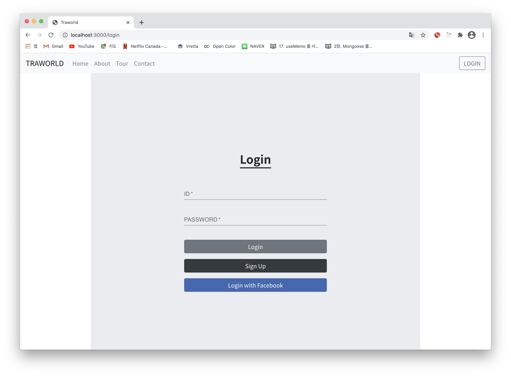
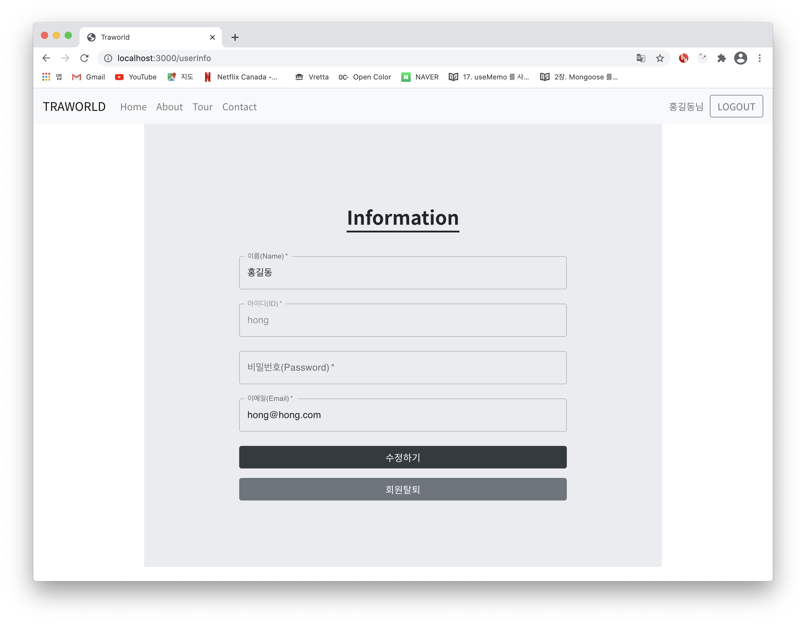

# Ttraworld Web Project

### 작품 개요
Node.js와 React를 이용한 여행 투어 예약 웹사이트
* * *

### 개발 환경
+ Node.js 
+ React
+ MongoDB
* * *

### 주요 기능
+ 로그인/로그아웃 (with Facebook)
+ 회원가입/회원탈퇴
+ 투어 상품 보기 및 상세 보기
+ 유저 정보 확인 및 변경
+ 회사 위치 확인 (Kakao Maps API)
+ 문의 메일 보내기
* * *

### 개발 기간
2021-02-04 ~ 개발중
* * *

### Home page

### Tour page

### Contact page

### Login page

### SignUp page

### User Information page

